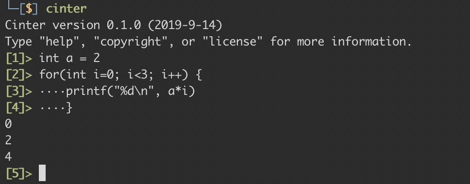

# Cinter

Cinter is a pseudo C language interactive tool which is short for C-interactive. It creates a REPL for C language so that we can try some small testcases in it and don't have to write the bothering formula like head files and main function. All you need to do is typing `cinter` and writing your codes. 

After launching, Cinter maintains a C source file `cinter.c` including commonly used head files (although now is few) and main function. When a statement is input to REPL, it will be written in the right place in `cinter.c` and build&run depending on the situation. 

## Developing

<<<<<<< HEAD
The project has just started with only preliminary functions. Besides, it is my first open source project and any advice is well welcome. 
=======
The project has just started and only has preliminary functions. It is developed on macOS and other operating systems haven't been tested. Besides, it is my first open source project and any advice is well welcome. 
>>>>>>> 00c8967d254abc37ffbc5f7be0b4692b6ebb4479
